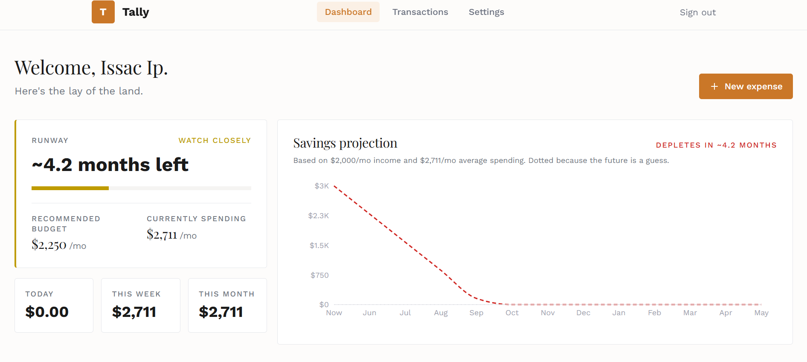
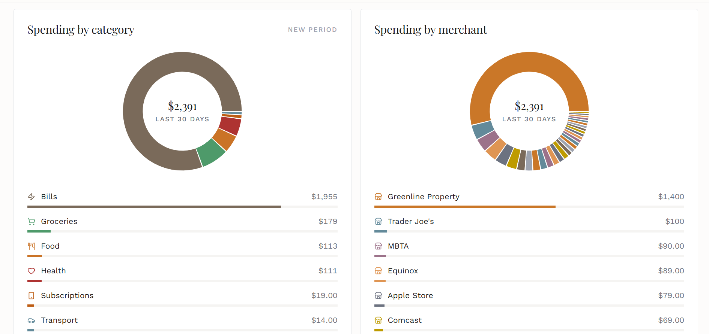

# tally

A personal finance tracker that shows how long your savings will last
at your current spending rate. Sign in with Google, log expenses, and
see your runway projected forward 12 months with a dotted line marking
when you'd hit zero.

**Live demo:** https://tally-issac.vercel.app



## What it does

I built tally because I wanted one specific thing from a budget app:
a clear answer to "how long can I keep spending like this?" Most apps
I tried buried that answer behind income/expense balancing or didn't
have it at all. Tally puts it front and center. The dashboard leads
with a color-coded runway indicator, a savings projection line chart
with a depletion marker, and breakdowns of where the money actually
goes by category and by merchant.

The repo is open source but the data isn't. Per-user data isolation
is enforced by Postgres Row Level Security, so the public code can't
be used to read another user's numbers even if I made a mistake in
app-layer filtering.

## Stack

- **Framework:** Next.js 16 with App Router, TypeScript
- **Styling:** Tailwind CSS v4 with custom design tokens
- **Auth:** Supabase Auth with Google OAuth
- **Database:** Supabase Postgres with Row Level Security
- **Charts:** Recharts
- **Tests:** Vitest, on the core math (runway, projection, aggregations)
- **Deployment:** Vercel

## Features

**The core idea**

- Color-coded runway indicator (healthy / watch / tight / critical)
  showing how long current savings will last at the current burn rate
- 12-month savings projection line chart with a red depletion marker
  if you'd hit zero within the window
- Vs-prior-30-days spending delta with red-up / green-down semantics

**The basics**

- Google sign-in with per-user data isolation
- Add and delete expenses (amount, category, merchant, date, notes)
- Spending breakdowns by category and by merchant, each as a donut
  with a list of progress bars
- Settings page to update savings and salary at any time
- Responsive layout for mobile and desktop



## Running locally

You'll need a free Supabase project. The `supabase/migrations/` folder
has the schema and RLS policies you'll need to run in the Supabase
SQL editor.

```bash
git clone https://github.com/issac-23/tally
cd tally
npm install
cp .env.example .env.local
# Fill in your Supabase URL and anon key
# Run the SQL files in supabase/migrations/ in your Supabase SQL editor
npm run dev
```

Then open http://localhost:3000.

## What I learned

- **Row Level Security as the actual security boundary.** Trusting
  the database to enforce per-user isolation instead of trusting
  application code to filter rows. The open-source-code-private-data
  model is only possible because RLS catches mistakes the app layer
  might miss.
- **Server vs client components in App Router.** The pattern of
  fetching data on the server, doing aggregation in pure functions,
  and rendering small client islands for interactivity. Recharts has
  to be client because it touches the DOM, but the data prep stays
  on the server.
- **Pure functions are how you actually test things.** All the math
  (runway, projection, category and merchant aggregation, period
  comparison) lives in plain TS files with no React, no Supabase, no
  DOM. That made unit-testing edge cases trivial: empty inputs,
  divide-by-zero, fractional depletion months, threshold boundaries.
- **Tests catch real bugs, not just regressions.** The spending util
  was silently dropping today's transactions for any user in a
  timezone west of UTC because `new Date("YYYY-MM-DD")` parses as UTC
  midnight while the threshold used local midnight. The test failed
  the moment it ran in EDT, surfaced the bug, prompted the fix.
